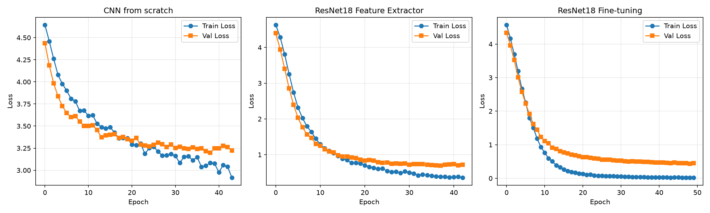
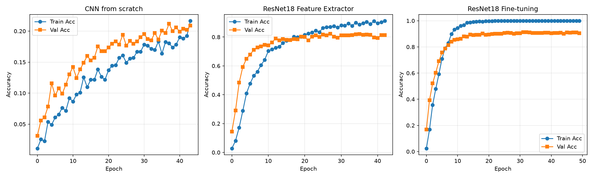

# Lab 1: CNN Comparison on Flowers102

This project compares three approaches to image classification: training a CNN from scratch, using a pre-trained ResNet18 as a frozen feature extractor, and fine-tuning a pre-trained ResNet18.

## Dataset

We use **Flowers102** from torchvision — 102 flower species, ~8k images split into 1,020 train / 1,020 val / 6,149 test. It's a fine-grained classification task (10 images per class), which makes it challenging for models trained from scratch but ideal for demonstrating transfer learning. All images are resized to 224×224 and normalized with ImageNet statistics.

### Data Augmentation (training only)

- `RandomResizedCrop` (scale 0.8–1.0): handles varied flower positions
- `RandomHorizontalFlip`: flowers are rotationally symmetric
- `ColorJitter` (±0.2): robustness to lighting variations

Validation and test use deterministic center crops.

## Approaches

### 1. CNN from Scratch

A small CNN with 4 convolutional blocks, each with Conv(3×3) → BatchNorm → ReLU → MaxPool → Dropout(0.25). Progressive channel widening: 3 → 32 → 64 → 128 → 256. Global average pooling feeds into a 2-layer FC head (256 → 256 → 102). Total params: ~600k.

**Why this design:** small parameter count is critical with 1,020 training images. GAP avoids huge flattened layers that would memorize. Dropout and BatchNorm at every stage prevent overfitting.

### 2. Feature Extractor

ResNet18 pre-trained on ImageNet, all backbone parameters frozen. The original FC layer is replaced with a trainable head: Linear(512→256) → ReLU → Dropout(0.5) → Linear(256→102). Only ~160k parameters train.

**Why ResNet18:** good balance of transfer-learning strength and training speed; not MobileNet (assignment constraint).

### 3. Fine-tuning

Same ResNet18 and head, but `layer4` (the last residual stage, ~8.4M params) is unfrozen and co-trained with the head. Learning rate is lowered to 1e-4 (vs 1e-3) to gently adapt pre-trained weights rather than destroy them.

**Why layer4:** early layers learn generic edges/textures that transfer well unchanged; `layer4` encodes task-specific high-level features that benefit from specializing to flowers.

## Training

| Setting | Value |
|---|---|
| Framework | PyTorch Lightning |
| Optimizer | Adam, weight decay 1e-4 |
| LR | 1e-3 (CNN, FE) / 1e-4 (FT) |
| Batch size | 32 |
| Max epochs | 50 |
| Early stopping | val_loss, patience 5 |

## Results

| Model | Best Val Loss | Best Val Acc | Epochs |
|---|---|---|---|
| CNN from scratch | 3.199 | 21.2% | 44 / 50 |
| Feature extractor | 0.697 | 82.4% | 43 / 50 |
| Fine-tuning | 0.432 | 91.3% | 50 / 50 |




## Overfitting Analysis

**CNN from scratch:** Train and validation loss descend together with no divergence — overfitting is not the problem. Validation accuracy plateaus at 21% because the model lacks capacity to learn 102 fine-grained categories from 10 images per class. Regularization works (no memorization), but the task is simply too hard from scratch.

**Feature extractor:** Train accuracy climbs to ~95% while validation stays at ~82%. The gap opens around epoch 10 but validation loss never increases — it flattens and stays flat. Frozen backbone + Dropout(0.5) keep overfitting controlled.

**Fine-tuning:** Train reaches 100% accuracy while validation settles at 91%. Classic overfitting signature, but validation loss keeps improving until epoch 48 and never goes up. The safety net (low LR, dropout, weight decay, early stopping) holds it in check.

## Conclusions

1. **Transfer learning is massive:** frozen ImageNet features alone jump from 21% → 82% (+61 points). Pre-trained features encode knowledge that would require orders of magnitude more data to learn from scratch.

2. **Fine-tuning adds value:** adapting layer4 pushes 82% → 91% (+9 points). Generic features are good, but task-specific adaptation matters.

3. **Practical takeaway:** for small fine-grained datasets, start pre-trained. Use frozen features if compute is tight; fine-tune with low LR when accuracy matters. Training from scratch only makes sense with abundant data or a domain far from ImageNet.

## Reproducing

```bash
uv sync
make train              # Full pipeline: all 3 models + plots
make cnn               # Individual models: cnn / feature_extractor / fine_tuning
make plots             # Regenerate plots from existing logs
make train EPOCHS=100  # Train for N epochs (default 50)
```

Code: `src/dataset.py` (data), `src/cnn.py` (scratch CNN), `src/pretrained.py` (transfer models), `src/lightning.py` (training loop), `main.py` (orchestration).
